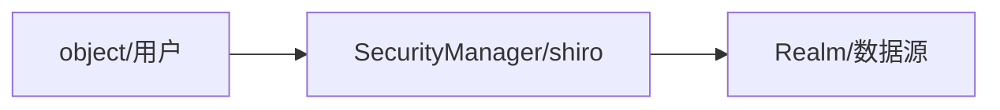

## 简介

Apache Shiro是java的一个安全框架，和`Spring Security`比相对简单，功能简单，使用简单，适合小型简单的项目。

#### 功能

* Authentication：身份认证/登陆，验证用户身份
* Authorization：授权，权限验证，验证已认证的用户是否拥有某个权限
* session manager：会话管理
* cryptography：加密
* web support：web支持
* caching：缓存
* concurrency：多线程并发验证，即如在一个线程中开启另一个线程，能把权限自动传播过去；
* testing：测试支持
* run as：运行一个用户假装另一个用户的身份进行登陆
* remember me：记住我密码功能

#### 原理



#### 简单体验登陆

1. 在gradle引入依赖`compile group: 'org.apache.shiro', name: 'shiro-core', version: '1.4.0'`

2. 在目录`resources`下新建一个`shiro.ini`文件

   ```ini
   # users 标签下面格式为
   # 用户名 = 密码,角色1，角色2，....,角色N
   [users]
   root = secret, admin
   guest = guest, guest
   test = 123456,test
   
   # roldes 角色标签下面格式为
   # 角色 = 权限1，权限2, ....权限N
   [roles]
   admin = *
   ```

3. 创建登陆方法，`IniSecurityManagerFactory`该方法在1.4已经过期了，用下面的方法

   ```java
   //Factory<SecurityManager> factory=new IniSecurityManagerFactory("classpath:shiro.ini"); //此方法过期
   IniRealm iniRealm=new IniRealm("classpath:shiro.ini"); //读取shiro配置文件
   SecurityManager securityManager=new DefaultSecurityManager(iniRealm);
   SecurityUtils.setSecurityManager(securityManager);
   Subject currentUser=SecurityUtils.getSubject();
   if (!currentUser.isAuthenticated()){
       UsernamePasswordToken token=new UsernamePasswordToken("admin","1");
       token.setRememberMe(true);
       try {
           currentUser.login(token);
       }catch (UnknownAccountException una){
           System.out.print("用户名不存在"+una.getMessage());
       }catch (IncorrectCredentialsException ice){
           System.out.print("无效的认证"+ice.getMessage());
       }catch (LockedAccountException lae){
           System.out.print("你的账户被锁定"+lae.getMessage());
       }catch (AuthenticationException ae){
           System.out.print("未知错误"+ae.getMessage());
       }
   }
   ```

#### shiro名词概念解释

* subject ：当前操作的用户
* SecurityManager ：shiro框架核心，内部组件管理
* realm : 连接桥梁，用于和用户数据，权限数据连接（来源文件、数据库）

xml配置

```xml
<bean id="securityManager" class="org.apache.shiro.web.mgt.DefaultWebSecurityManager">
    <property name="realms" ref="customRealm"/>
    <property name="cacheManager" ref="cacheManager"/>
    <property name="sessionManager" ref="sessionManager"/>
</bean>
```

数据库表设计：


### 参考

[Shiro权限控制框架入门](https://www.zifangsky.cn/770.html)


