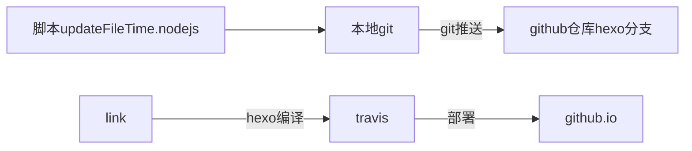

### 前提介绍

上篇介绍了**批量写入文件的修改时间**用于hexo博客的初始化，这篇是在上篇基础上添加的新需求

上篇有的方法这篇就不介绍了

#### 需求描述

由于每次修改了文章，都要改文章的头部的更新时间，如此机械的事当然要交给程序来做啦，因此写了此脚本

#### 设计

1. 更新文章更新时间脚本逻辑`updateFileTime.nodejs`

   ```mermaid
   graph LR
   a[遍历文章目录]-->b[读取文件内容]
   b-->c[读取文间修改时间]
   link-->d[文件修改时间和文章时间比较]
   d-->|满足条件|f[替换文章更新时间为文件修改时间]
   link2-->g[最后修改回文件的修改时间和访问时间]
   ```

2. 执行脚本`update.sh`，用于一键推送发布博客



### 脚本内容解读

#####  `updateFileTime.nodejs`脚本

匹配文章`updated: 2018-04-25 20:47:32`字段的正则表达式RegExp

```
(updated:\s*)((\d{2}(([02468][048])|([13579][26]))[\-\/\s]?((((0?[13578])|(1[02]))[\-\/\s]?((0?[1-9])|([1-2][0-9])|(3[01])))|(((0?[469])|(11))[\-\/\s]?((0?[1-9])|([1-2][0-9])|(30)))|(0?2[\-\/\s]?((0?[1-9])|([1-2][0-9])))))|(\d{2}(([02468][1235679])|([13579][01345789]))[\-\/\s]?((((0?[13578])|(1[02]))[\-\/\s]?((0?[1-9])|([1-2][0-9])|(3[01])))|(((0?[469])|(11))[\-\/\s]?((0?[1-9])|([1-2][0-9])|(30)))|(0?2[\-\/\s]?((0?[1-9])|(1[0-9])|(2[0-8]))))))(\s((([0-1][0-9])|(2?[0-3]))\:([0-5]?[0-9])((\s)|(\:([0-5]?[0-9])))))
```

脚本用到的主要方法有

```javascript
var data;//文章内容
RegExp.test(data);//文章内容包含正则匹配的内容返回true，没有false
 //取出正则匹配到的值，返回是数组['updated: 2018-04-25 20:47:32']
var updateds=data.match(RegExp);
//时间格式化为2018/01/29 21:33:30，因为这样就可以通过Date.parse()得到时间了
var updated=updateds[0].replace("updated: ","").replace(/-/g,"/");
//修改文件的状态信息，防止该脚本更改修改时间，导致后来修改时间不准确
//其实文件内容变了，但并不会记录此脚本的改的记录，因此要重新打开文章才会发现时间改变
fs.utimes(file,atime,mtime,function(err){});//atime访问时间，mtime修改时间
```

##### `updateFileTime.nodejs`脚本内容

```javascript
#!/usr/bin/env node
/*
批量更新修改时间
用于bolg自动更新修改时间
*/

console.log('文件创建时间读取并写入文件指定字段demo');
var fs = require("fs"); //请求文件系统
var file = "./txt"; //设置读取和写入的文件，当前目录下的test文件
var RegExp=/(updated:\s*)((\d{2}(([02468][048])|([13579][26]))[\-\/\s]?((((0?[13578])|(1[02]))[\-\/\s]?((0?[1-9])|([1-2][0-9])|(3[01])))|(((0?[469])|(11))[\-\/\s]?((0?[1-9])|([1-2][0-9])|(30)))|(0?2[\-\/\s]?((0?[1-9])|([1-2][0-9])))))|(\d{2}(([02468][1235679])|([13579][01345789]))[\-\/\s]?((((0?[13578])|(1[02]))[\-\/\s]?((0?[1-9])|([1-2][0-9])|(3[01])))|(((0?[469])|(11))[\-\/\s]?((0?[1-9])|([1-2][0-9])|(30)))|(0?2[\-\/\s]?((0?[1-9])|(1[0-9])|(2[0-8]))))))(\s((([0-1][0-9])|(2?[0-3]))\:([0-5]?[0-9])((\s)|(\:([0-5]?[0-9])))))/g;

fs.readdir("./",function(err,files){
	var len=files.length;
	var file=null;
	for(var i=0;i<len;i++){
		file=files[i];
		console.log("读取文件：",file);
		if(file.indexOf(".md")>-1){
			console.log("处理文件：",file);
			writeFileTime(file,fs);
		}
	}
});

/*
file:读取时间的文件以及写入内容的文件
fs: 文件系统
*/
function writeFileTime(file,fs){
	fs.readFile(file, 'utf8',function(err, data) { //读取文件内容
		if (err) return console.log("读取文件内容错误：",err);
		//console.log("文件"+file+"的内容：",data);
		if(RegExp.test(data)){ //如果有匹配的字符串则进去
			fs.stat(file,function(err, stats) { //读取文件信息，创建时间等
				if (err) return console.log("读取文件信息错误：",err);
				var updateds=data.match(RegExp);
				console.log("updated数组:",updateds);
				if(updateds.length>1) console.log("文件"+file+"匹配到多处update字段");
				var updated=updateds[0].replace("updated: ","").replace(/-/g,"/");  //时间格式化为2018/01/29 21:33:30
				console.log("updated:",updated);
				if(new Date(stats.mtime).getTime()-new Date(Date.parse(updated))>1000*60*5){
					var result= data.replace(RegExp,"updated: "+getFormatDate(stats.mtime)); //替换更新时间
					fs.writeFile(file, result, 'utf8',function(err) { //写入新的文件内容
						if (err) return console.log("写文件错误：",err);
						fs.utimes(file,new Date(stats.atime),new Date(stats.mtime),function(err){  //还原访问时间和修改时间
							if (err) return console.log("修改时间失败：",err);
							console.log(file,"成功更新时间");
						});
					});
				}
			});
		}	
	});
}

/*
 timeStr:时间，格式可为："September 16,2016 14:15:05、
 "September 16,2016"、"2016/09/16 14:15:05"、"2016/09/16"、
 '2014-04-23T18:55:49'和毫秒
 dateSeparator：年、月、日之间的分隔符，默认为"-"，
 timeSeparator：时、分、秒之间的分隔符，默认为":"
 */
function getFormatDate(timeStr, dateSeparator, timeSeparator) {
    dateSeparator = dateSeparator ? dateSeparator : "-";
    timeSeparator = timeSeparator ? timeSeparator : ":";
    var date = new Date(timeStr),
            year = date.getFullYear(),// 获取完整的年份(4位,1970)
            month = date.getMonth(),// 获取月份(0-11,0代表1月,用的时候记得加上1)
            day = date.getDate(),// 获取日(1-31)
            hour = date.getHours(),// 获取小时数(0-23)
            minute = date.getMinutes(),// 获取分钟数(0-59)
            seconds = date.getSeconds(),// 获取秒数(0-59)
            Y = year + dateSeparator,
            M = ((month + 1) > 9 ? (month + 1) : ('0' + (month + 1))) + dateSeparator,
            D = (day > 9 ? day : ('0' + day)) + ' ',
            h = (hour > 9 ? hour : ('0' + hour)) + timeSeparator,
            m = (minute > 9 ? minute : ('0' + minute)) + timeSeparator,
            s = (seconds > 9 ? seconds : ('0' + seconds)),
            formatDate = Y + M + D + h + m + s;
    return formatDate;
}
```

##### `update.sh`脚本

由于懒得去设置目录，就直接cd切换过去，再切换回来把

其中`"$*"` 表示介绍所有参数，例如`./update.sh 我是提交信息 哈哈哈哈`就会被传递到`git commit -m "我是提交信息 哈哈哈哈"`

```sh
#!/bin/sh
cd source/_posts/ && ./updateFileTime.nodejs && cd .. && cd .. && git add --all && git commit -m "$*" && git push origin hexo
```


### 更新优化版本，添加图片自动更新链接，以及优化为同步和异步两个版本

同步版本

```js
#!/usr/bin/env node
/*
同步版本
批量更新修改时间
用于bolg自动更新修改时间
批量替换本地链接为网络链接，使用七牛图床
*/

console.log('开始检测更新时间和图片');
var fs = require("fs"); //请求文件系统
var file = "./txt"; //设置读取和写入的文件，当前目录下的test文件
var RegExp=/(updated:\s*)((\d{2}(([02468][048])|([13579][26]))[\-\/\s]?((((0?[13578])|(1[02]))[\-\/\s]?((0?[1-9])|([1-2][0-9])|(3[01])))|(((0?[469])|(11))[\-\/\s]?((0?[1-9])|([1-2][0-9])|(30)))|(0?2[\-\/\s]?((0?[1-9])|([1-2][0-9])))))|(\d{2}(([02468][1235679])|([13579][01345789]))[\-\/\s]?((((0?[13578])|(1[02]))[\-\/\s]?((0?[1-9])|([1-2][0-9])|(3[01])))|(((0?[469])|(11))[\-\/\s]?((0?[1-9])|([1-2][0-9])|(30)))|(0?2[\-\/\s]?((0?[1-9])|(1[0-9])|(2[0-8]))))))(\s((([0-1][0-9])|(2?[0-3]))\:([0-5]?[0-9])((\s)|(\:([0-5]?[0-9])))))/g;
var imgReg=/\!\[[\s\S]*?\]\([\s\S]*?\)/g;

var files= fs.readdirSync("./");

var len=files.length;
var file=null;
for(var i=0;i<len;i++){
	file=files[i];
	//console.log("读取文件：",file);
	if(file.indexOf(".md")>-1){
		//console.log("处理文件：",file);
		writeFileTime(file,fs);
	}
}


/*
file:读取时间的文件以及写入内容的文件
fs: 文件系统
*/
function writeFileTime(file,fs){
	var data = fs.readFileSync(file, 'utf8');
	if(RegExp.test(data)){ //如果有匹配的字符串则进去
		var stats= fs.statSync(file);
		var updateds=data.match(RegExp);
	    var updated=updateds[0].replace("updated: ","").replace(/-/g,"/");  //时间格式化为2018/01/29 21:33:30
		if(new Date(stats.mtime).getTime()-new Date(Date.parse(updated))>1000*60*5){
			console.log(file,"时间处理："+updateds[0]);
			var result= data.replace(updateds[0],"updated: "+getFormatDate(stats.mtime)); //替换更新时间
			fs.writeFileSync(file, result, 'utf8');
			fs.utimesSync(file,new Date(stats.atime),new Date(stats.mtime));
			console.log(file,"成功更新时间:"+updateds[0].replace(updateds[0],"updated: "+getFormatDate(stats.mtime)));
		}			
	}
	if(imgReg.test(data)){ //匹配markdown图片
		console.log(file,"开始处理图片");
		var imgpaths=data.match(imgReg);
		for (var i = imgpaths.length - 1; i >= 0; i--) {
			var imgpath=imgpaths[i];
			console.log(imgpath);
			if (imgpath.indexOf("xuanfong1.github.io\\source\\_posts\\image")!=-1||imgpath.indexOf("xuanfong1.github.io/source/_posts/image")!=-1) {
				console.log(file,"处理:"+imgpath);
				var filenametemp= imgpath.split('\\').pop();
				var filename=filenametemp.slice(0,filenametemp.length-1);
				var result=data.replace(imgpath,"");
				fs.writeFileSync(file, result, 'utf8');
				console.log("成功替换："+imgpath.replace(imgpath,""));
			}
		}
	}	
}

/*
 timeStr:时间，格式可为："September 16,2016 14:15:05、
 "September 16,2016"、"2016/09/16 14:15:05"、"2016/09/16"、
 '2014-04-23T18:55:49'和毫秒
 dateSeparator：年、月、日之间的分隔符，默认为"-"，
 timeSeparator：时、分、秒之间的分隔符，默认为":"
 */
function getFormatDate(timeStr, dateSeparator, timeSeparator) {
    dateSeparator = dateSeparator ? dateSeparator : "-";
    timeSeparator = timeSeparator ? timeSeparator : ":";
    var date = new Date(timeStr),
            year = date.getFullYear(),// 获取完整的年份(4位,1970)
            month = date.getMonth(),// 获取月份(0-11,0代表1月,用的时候记得加上1)
            day = date.getDate(),// 获取日(1-31)
            hour = date.getHours(),// 获取小时数(0-23)
            minute = date.getMinutes(),// 获取分钟数(0-59)
            seconds = date.getSeconds(),// 获取秒数(0-59)
            Y = year + dateSeparator,
            M = ((month + 1) > 9 ? (month + 1) : ('0' + (month + 1))) + dateSeparator,
            D = (day > 9 ? day : ('0' + day)) + ' ',
            h = (hour > 9 ? hour : ('0' + hour)) + timeSeparator,
            m = (minute > 9 ? minute : ('0' + minute)) + timeSeparator,
            s = (seconds > 9 ? seconds : ('0' + seconds)),
            formatDate = Y + M + D + h + m + s;
    return formatDate;
}

```


异步版本

```js
#!/usr/bin/env node
/*
异步版本
批量更新修改时间
用于bolg自动更新修改时间
批量替换本地链接为网络链接，使用七牛图床
*/

console.log('开始检测更新时间和图片');
var fs = require("fs"); //请求文件系统
var file = "./txt"; //设置读取和写入的文件，当前目录下的test文件
var RegExp=/(updated:\s*)((\d{2}(([02468][048])|([13579][26]))[\-\/\s]?((((0?[13578])|(1[02]))[\-\/\s]?((0?[1-9])|([1-2][0-9])|(3[01])))|(((0?[469])|(11))[\-\/\s]?((0?[1-9])|([1-2][0-9])|(30)))|(0?2[\-\/\s]?((0?[1-9])|([1-2][0-9])))))|(\d{2}(([02468][1235679])|([13579][01345789]))[\-\/\s]?((((0?[13578])|(1[02]))[\-\/\s]?((0?[1-9])|([1-2][0-9])|(3[01])))|(((0?[469])|(11))[\-\/\s]?((0?[1-9])|([1-2][0-9])|(30)))|(0?2[\-\/\s]?((0?[1-9])|(1[0-9])|(2[0-8]))))))(\s((([0-1][0-9])|(2?[0-3]))\:([0-5]?[0-9])((\s)|(\:([0-5]?[0-9])))))/g;
var imgReg=/\!\[[\s\S]*?\]\([\s\S]*?\)/g;

fs.readdir("./",function(err,files){
	var len=files.length;
	var file=null;
	for(var i=0;i<len;i++){
		file=files[i];
		//console.log("读取文件：",file);
		if(file.indexOf(".md")>-1){
			//console.log("处理文件：",file);
			writeFileTime(file,fs);
		}
	}
});

/*
file:读取时间的文件以及写入内容的文件
fs: 文件系统
*/
function writeFileTime(file,fs){
	fs.readFile(file, 'utf8',function(err, data) { //读取文件内容
		if (err) return console.log("读取文件内容错误：",err);
		//console.log("文件"+file+"的内容：",data);
		if(RegExp.test(data)){ //如果有匹配的字符串则进去
			fs.stat(file,function(err, stats) { //读取文件信息，创建时间等
				if (err) return console.log("读取文件信息错误：",err);
				var updateds=data.match(RegExp);
				//console.log("updated数组:",updateds);
				//if(updateds.length>1) console.log("文件"+file+"匹配到多处update字段");
				var updated=updateds[0].replace("updated: ","").replace(/-/g,"/");  //时间格式化为2018/01/29 21:33:30
				//console.log("updated:",updated);
				if(new Date(stats.mtime).getTime()-new Date(Date.parse(updated))>1000*60*5){
					console.log(file,"时间处理："+updateds[0]);
					var result= data.replace(updateds[0],"updated: "+getFormatDate(stats.mtime)); //替换更新时间
					fs.writeFile(file, result, 'utf8',function(err) { //写入新的文件内容
						if (err) return console.log("写文件错误：",err);
						fs.utimes(file,new Date(stats.atime),new Date(stats.mtime),function(err){  //还原访问时间和修改时间
							if (err) return console.log("修改时间失败：",err);
							console.log("成功更新时间:"+updateds[0].replace(updateds[0],"updated: "+getFormatDate(stats.mtime)));
						});
					});
				}
			});
		}
		if(imgReg.test(data)){ //匹配markdown图片
			var imgpaths=data.match(imgReg);
			for (var i = imgpaths.length - 1; i >= 0; i--) {
				var imgpath=imgpaths[i];
				if (imgpath.indexOf("xuanfong1.github.io\\source\\_posts\\image")!=-1 || imgpath.indexOf("xuanfong1.github.io/source/_posts/image")!=-1) {
					console.log(file,"处理:"+imgpath);
					var filenametemp= imgpath.split('\\').pop();
					var filename=filenametemp.slice(0,filenametemp.length-1);
					var result=data.replace(imgpath,"");
					fs.writeFile(file, result, 'utf8',function(err) { //写入新的文件内容
						if (err) return console.log("写文件错误：",err);
						console.log("成功替换："+imgpath.replace(imgpath,""));
					});
				}
			}
		}	
	});
}

/*
 timeStr:时间，格式可为："September 16,2016 14:15:05、
 "September 16,2016"、"2016/09/16 14:15:05"、"2016/09/16"、
 '2014-04-23T18:55:49'和毫秒
 dateSeparator：年、月、日之间的分隔符，默认为"-"，
 timeSeparator：时、分、秒之间的分隔符，默认为":"
 */
function getFormatDate(timeStr, dateSeparator, timeSeparator) {
    dateSeparator = dateSeparator ? dateSeparator : "-";
    timeSeparator = timeSeparator ? timeSeparator : ":";
    var date = new Date(timeStr),
            year = date.getFullYear(),// 获取完整的年份(4位,1970)
            month = date.getMonth(),// 获取月份(0-11,0代表1月,用的时候记得加上1)
            day = date.getDate(),// 获取日(1-31)
            hour = date.getHours(),// 获取小时数(0-23)
            minute = date.getMinutes(),// 获取分钟数(0-59)
            seconds = date.getSeconds(),// 获取秒数(0-59)
            Y = year + dateSeparator,
            M = ((month + 1) > 9 ? (month + 1) : ('0' + (month + 1))) + dateSeparator,
            D = (day > 9 ? day : ('0' + day)) + ' ',
            h = (hour > 9 ? hour : ('0' + hour)) + timeSeparator,
            m = (minute > 9 ? minute : ('0' + minute)) + timeSeparator,
            s = (seconds > 9 ? seconds : ('0' + seconds)),
            formatDate = Y + M + D + h + m + s;
    return formatDate;
}

```


